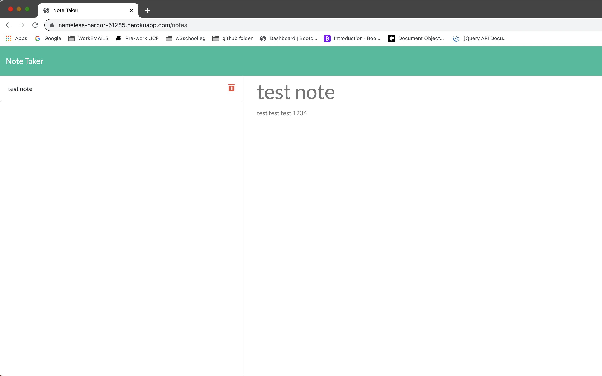
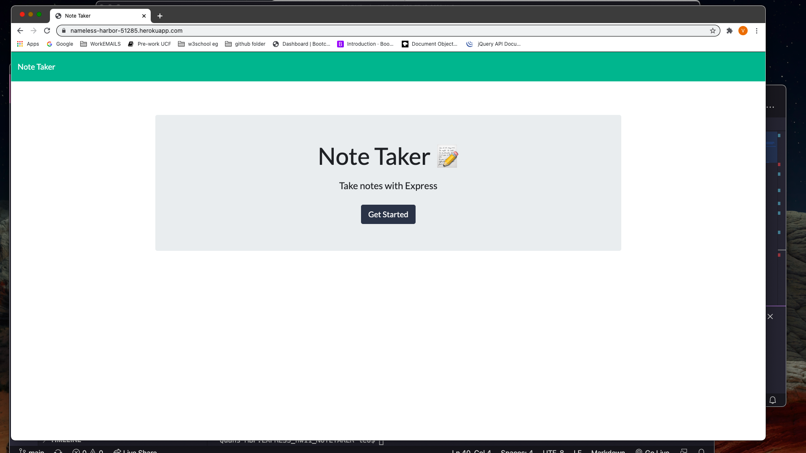

# NOTE TAKER generator
  
  ## Table of Contents
  * [Description](#description)
  * [Installation](#installation)
  * [Usage](#usage)
  * [Contributors](#contributors)
  * [License](#license)
  * [Test](#test)
  * [Questions](#questions)
  * [Demo](#demo)
  
  ## Description
  A web application based on npm express and node.js using HEROKU as a host site.It can be used to write, save, and delete notes.This application will use an express backend and save and retrieve note data from a JSON file
  
  ## Installation 
  git clone from my github, then npm i, or click on my attached heroku deployed link.
  
  ## Usage 
  AS A user, I want to be able to write and save notes
  
  ## Contributors rules
  I WANT to be able to delete notes I've written before
  
  ## License
  MIT
  
  ## Test
  run nodemon server.js after npm i

  ## Questions
  Contact me:
  
  Github:[leolee2708](https://github.com/leolee2708)
  
  Email:[leho.vietquan@gmail.com](https://github.com/leolee2708)

  ## Demo

  
  